# Tock

A digital version of the Tock (Keezen) board game: an Angular frontend served by a Spring Boot backend.

## What a game looks like

Two to eight players. Each game below is shown twice — the same seeded position on a computer and
on a phone, since the board switches to a dedicated layout on narrow screens.

<!-- GAMES:START -->
<!-- Auto-generated by frontend/e2e/readme-images.spec.ts. Do not edit between these markers;
     run `./generate-readme-images.sh` to refresh the images and this text. -->

### 2 players

The smallest game: two sections facing each other. Every player plays for themselves.

| On a computer | On a phone |
| --- | --- |
| 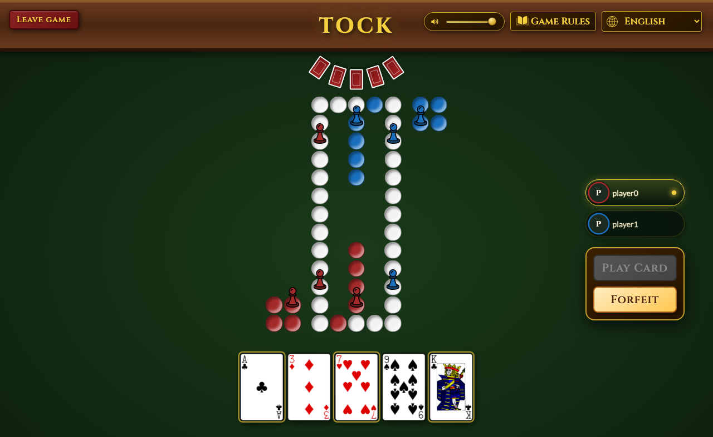 | 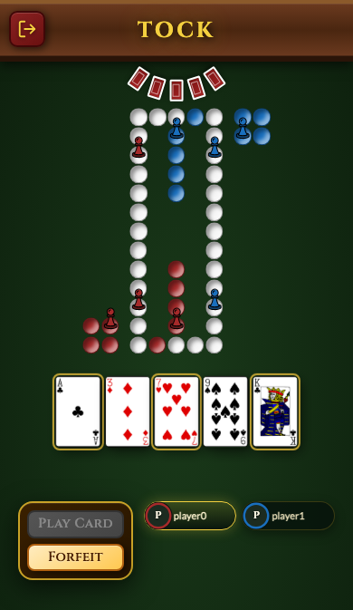 |

### 4 players

The classic setup: four sections, four pawns each. The board always rotates so your own section is at the bottom and the other players fan their cards around you.

| On a computer | On a phone |
| --- | --- |
| 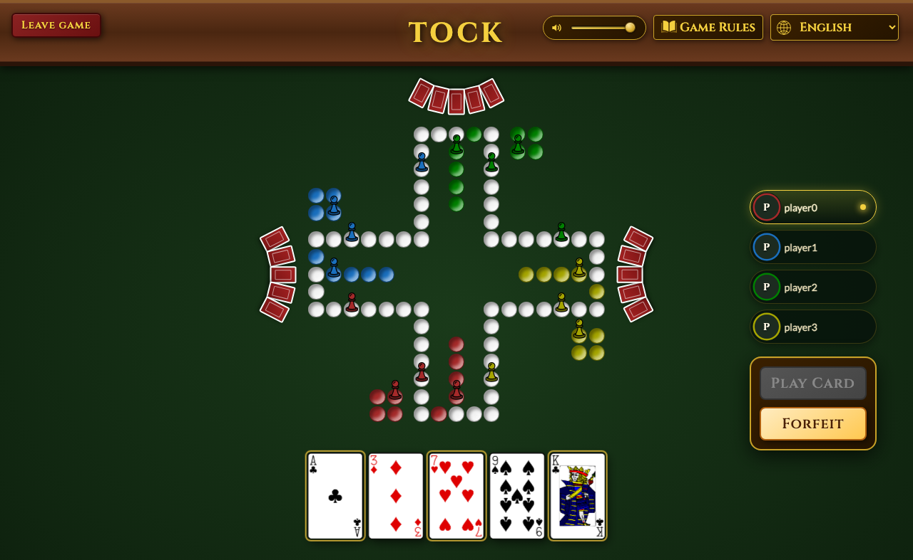 | 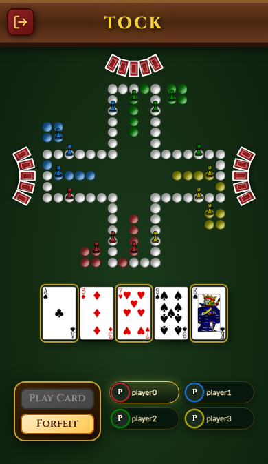 |

### 6 players, in teams

With team play on, an even number of players pairs up with the seat opposite — six players make three teams. Each pawn flies its team pennant and the roster lists the pairs; once all your own pawns are home you play your teammate’s.

| On a computer | On a phone |
| --- | --- |
| 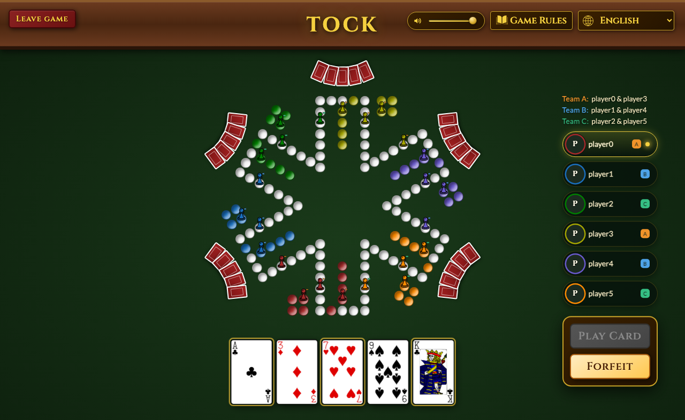 | 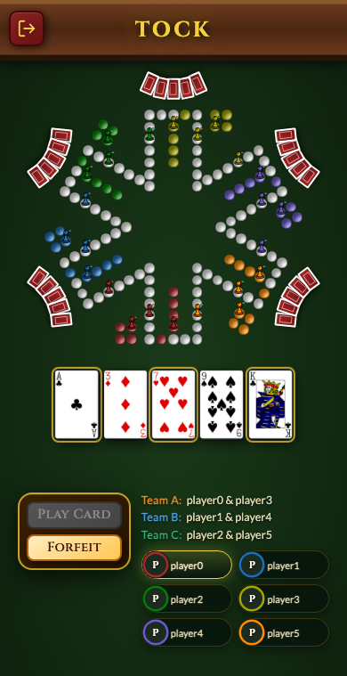 |

### Asking your teammate for a King or Ace

Only a King or an Ace gets a pawn out of the nest, so with the team-trade option on you may ask your teammate for one. The “Ask for a King or Ace” button opens your hand: pick the card you are willing to give away, then ask.

| On a computer | On a phone |
| --- | --- |
| 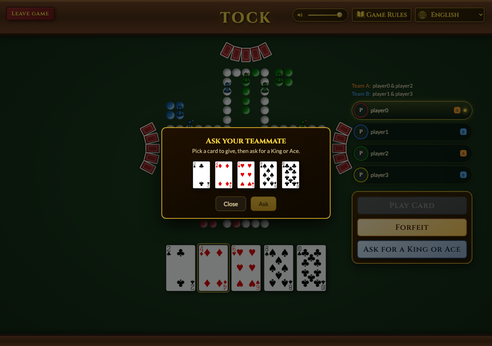 | 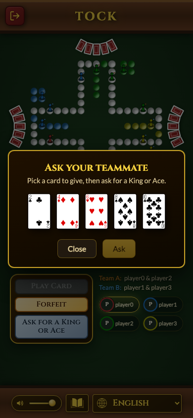 |

### Waiting for their answer

Once you have asked, the ball is in your teammate’s court. You can sit it out or withdraw the request — and you keep playing either way; the trade never blocks the game.

| On a computer | On a phone |
| --- | --- |
| 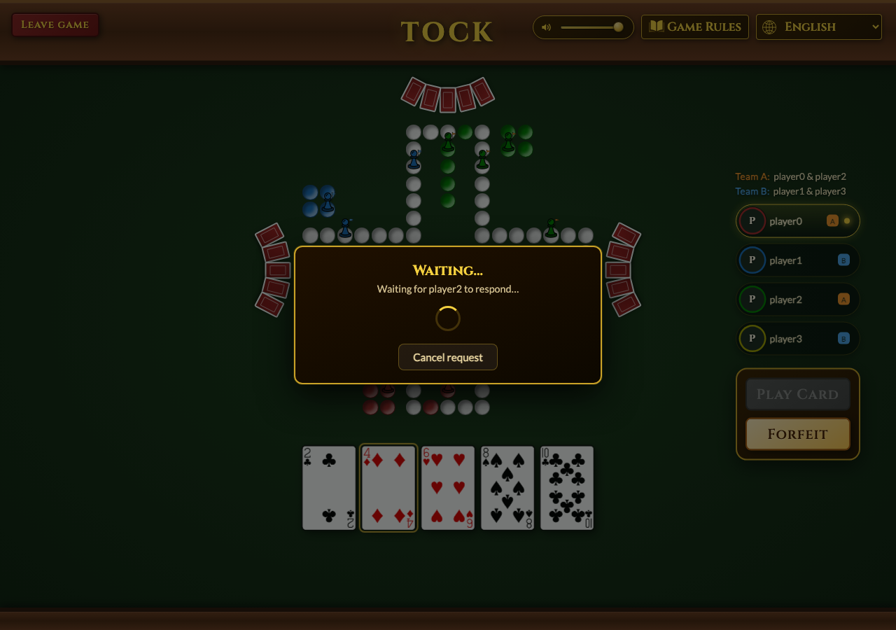 | 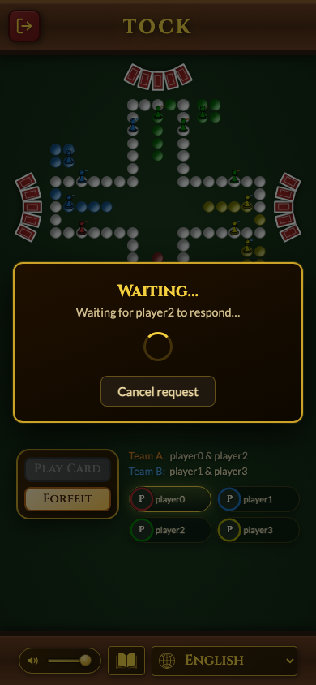 |

### Being asked, and offering a card in return

On the other side of the same parley: your teammate has asked you. Your hand is shown with everything but the Kings and Aces dimmed out — those are the only cards that answer the ask — so you either give one in return, or decline.

| On a computer | On a phone |
| --- | --- |
| 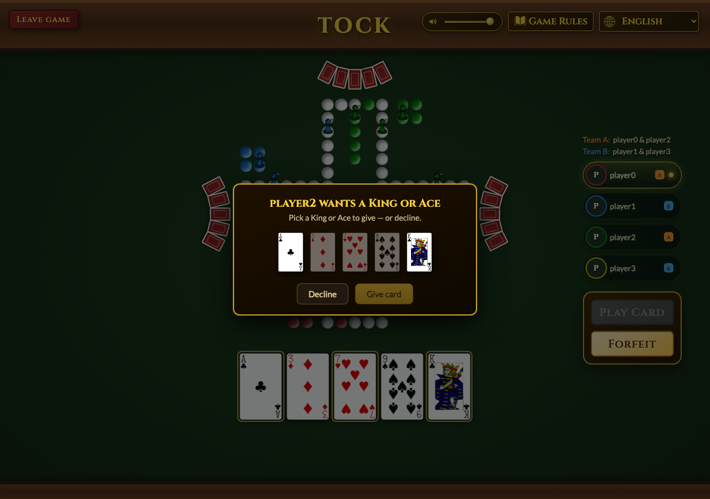 | 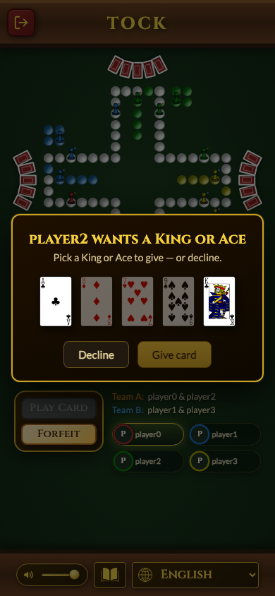 |

### When they cannot help

A teammate holding neither a King nor an Ace can only decline. The answer reaches you as a banner, your offered card stays in your hand, and the trade window closes — you are free to ask again after the next deal.

| On a computer | On a phone |
| --- | --- |
| 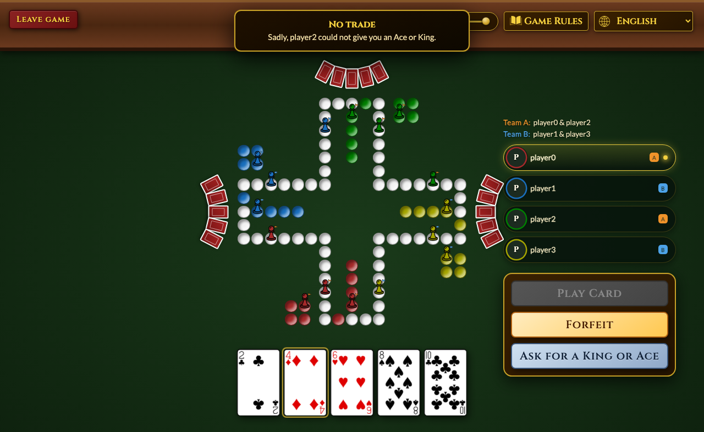 | 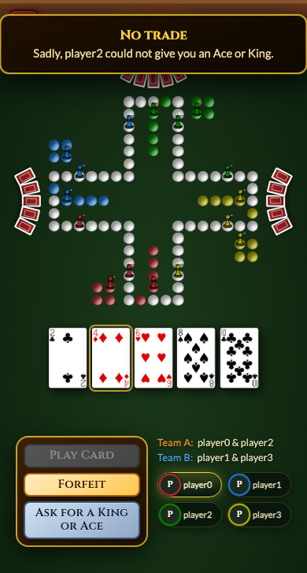 |

<!-- GAMES:END -->

## How the board is built


## Running the app
The Spring backend serves the built Angular app (this is what `./deploy.sh` ships):

```
cd frontend && npm run build
mvn spring-boot:run -pl backend -am -Penv-angular   # Angular served at http://localhost:4200/
```

For frontend hot-reload dev, `cd frontend && npm start` runs ng serve on 4201 and proxies the
API to the backend on 4200.

## Deploying to Raspberry Pi

Run `./deploy.sh` to build the Angular app, package it into the server jar (`env-angular`),
upload, and restart the service.

**The app is reached at `/keezen`, but nginx strips that prefix before the backend.** The
Angular build sets `base-href=/keezen/`, and the app derives the prefix from `<base href>` at
runtime (`basePath()` in `src/app/base-path.ts`) so the browser requests `/keezen/games`,
`/keezen/gamestates/…/stream`, `/keezen/study-icon.svg`, etc. The nginx `location /keezen/`
block **strips** `/keezen/` (trailing slash on `proxy_pass`) and forwards `/games`, `/main-*.js`,
… to the backend:

```nginx
location /keezen/ {
  proxy_pass http://127.0.0.1:4200/;   # trailing slash → strips /keezen/
  proxy_set_header Host $host;
  # For the SSE streams (/gamestates, /chat) add if updates don't flow:
  # proxy_http_version 1.1; proxy_buffering off; proxy_read_timeout 3600s;
}
```

So the backend must serve at the **root — no context-path** (`deploy.sh` writes an empty
override). A context-path of `/keezen` here would double the prefix and 404 every request.
Local dev/tests run at the root too (default base-href `/` → `basePath()` returns `''`).

## Built with
- Angular (TypeScript) — the frontend UI
- Spring Boot — the backend and game engine
- OpenAPI — the API contract and generated TypeScript client
- Testing — JUnit + Vitest unit tests, Playwright end-to-end browser tests, Mockito
- Continuous Integration

_This started as a GWT project (Java compiled to JavaScript) and was migrated to Angular._
